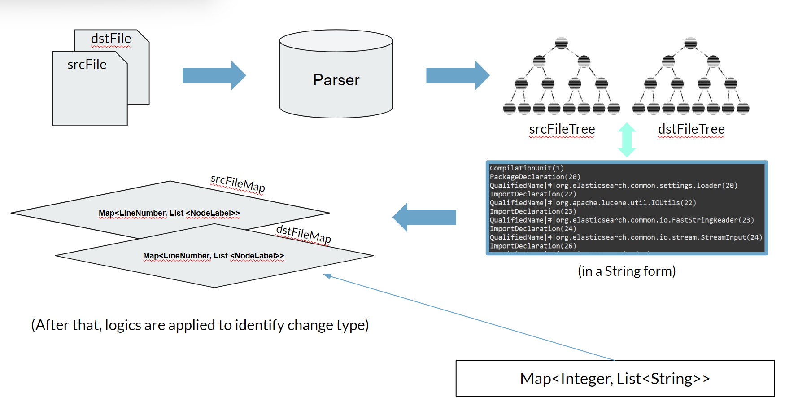
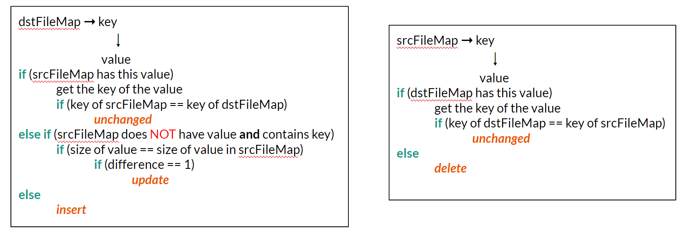

# SourceCodeDiff
Souce Code Differencing algorithm to generate an edit scripts for old and new source Java files

## How to generate edit scripts by our algorithm
Run src/parser/Parser.java. 

Get on the output screen reports which change passed as following:
```
...
change passed 497
change passed 498
change passed 499
...
```
Edit scripts saved in the folder src/ourES as a separate .txt file for each.

Example of changeTest001.txt:
```
Update: QualifiedName|#|org.elasticsearch.common.io.stream.BytesStreamInput
Insert: ImportDeclaration
Insert: VariableDeclarationStatement
Delete: ImportDeclaration
Delete: VariableDeclarationStatement
```
## How to generate edit scripts by GumTree
Run src/gumtree/GumTreeTest.java.

Get on the output screen reports which change passed as following:
```
...
change passed 497
change passed 498
change passed 499
...
```
Edit scripts saved in the folder src/gumtree as a separate .txt file for each.
Example of changeTest001.txt:
```
[Update	QualifiedName@@org.elasticsearch.common.io.stream.StreamInput[23]	TO	org.elasticsearch.common.io.stream.BytesStreamInput
, Update	SimpleType@@StreamInput[54]	TO	BytesStreamInput
	Update	SimpleName@@StreamInput[54]	TO	BytesStreamInput
, Insert	ClassInstanceCreation@@[55]
	Insert	SimpleType@@BytesStreamInput[55]
	Insert	SimpleName@@BytesStreamInput[55]
	Insert	SimpleName@@source[56]
, Delete	MethodInvocation@@[55]
	Delete	SimpleName@@StreamInput[55]
	Delete	SimpleName@@wrap[55]
	Delete	SimpleName@@source[55]
]
```
## Structure of matcher and logics for changes
Structure:


Logics:


### Note
The key idea of generating edit scripts in this project is handling TreeNodes as Strings and saving in maps (line number - key, nodes in line - value) and applying logics above. Logics being applied, change type is detected -> getting first node in a list as a type of entity which changed.

# Authors
- Assel 
- Charlotte 
- Nurbek
- Elvin
